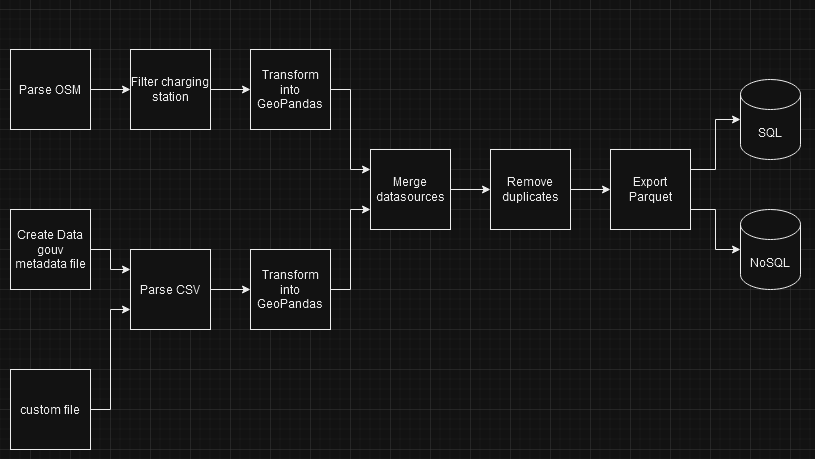

# Charging Station Merge Tools

The **Charging Station Merge Tools** is an open-source tool designed to aggregate, clean, and consolidate data from multiple sources to create a comprehensive, high-quality dataset of charging stations across France. This tool simplifies the integration of public and open-source data, providing a reliable and accurate foundation for applications in electric vehicle routing, analysis, and planning.

## 🚀 Features
- **Automated Download**: The tool automatically downloads the necessary files from default providers [OpenStreetMap](https://download.geofabrik.de/europe/france.html) and [data.gouv.fr](https://transport.data.gouv.fr/datasets/fichier-consolide-des-bornes-de-recharge-pour-vehicules-electriques) before parsing them.
- **Data Merging**: It merges charging points located within a specified radius to form coherent charging stations.
- **Flexible Export Options**: Data can be exported in Parquet format, with additional options for exporting to SQL or to a NoSQL database like MongoDB.



This tool is ideal for professionals and researchers looking to analyze charging infrastructure and contribute to the energy transition.

We invite you to explore the features of this tool and integrate it into your projects to optimize the management of charging stations.

### Data Provided in the Final Files
The final dataset produced by the **Charging Station Merge Tools** includes detailed and standardized information about EV charging stations across France. Here are the key data points included:
#### Charging station file
* ID: Unique identifier for each charging station
* Location: GPS coordinates (latitude and longitude).
#### Socket file
* ID: Unique identifier for each socket
* Itinerance ID: Roaming identifiers for charging stations refer to unique codes that enable the identification and management of access to electric vehicle charging stations, thereby facilitating interoperability between different operators and networks.
* Location: GPS coordinates (latitude and longitude).
* Charging Capacity: Number of charging points and their power ratings (e.g., 22 kW, 50 kW).
* Connector Types: Supported plug types (e.g., Type 2, CHAdeMO, CCS).
* Retrieve From: Indicates where the data was extracted
* Charging station ID: Link with charging station file

This detailed dataset can be used directly for routing algorithms, energy consumption modeling, or visualization tools.

### ⚠️ Warning
Please be aware that some data may be missing due to unavailability in the data sources. Additionally, there are other data points present in the files that have not been extracted. It is important to review the dataset carefully to understand any limitations and ensure comprehensive analysis.
## File tree
```
charging-station-data-tool/
│
├── src/                # Code source
├── docs/               # Documentation
├── tests/              # Scripts de tests
├── .gitignore          # Exclusions Git
├── README.md           # README
├── mkdocs.yml          # Mkdocs config file
├── main.py             # Entrypoint
├── poetry.lock         # Poetry lock file
└── pyproject.toml      # Poetry config file
```
## 🛠 Installation
### Dependencies
- [osmosis](https://github.com/openstreetmap/osmosis)
- [poetry](https://python-poetry.org/)

### Install
```bash
poetry install
```

## 💻 Usage
Run command
```bash
python main.py -c config.json
```

## 📝 License
This program is free software: you can redistribute it and/or modify
it under the terms of the GNU Lesser General Public License as published by
the Free Software Foundation, either version 3 of the License, or
(at your option) any later version.

This program is distributed in the hope that it will be useful,
but WITHOUT ANY WARRANTY; without even the implied warranty of
MERCHANTABILITY or FITNESS FOR A PARTICULAR PURPOSE. See the
GNU Lesser General Public License for more details.

You should have received a copy of the GNU Lesser General Public License
along with this program. If not, see <https://www.gnu.org/licenses/>.

## 🤝 Contributing
We welcome contributions!

Create a feature branch:
```bash 
git checkout -b feature-branch  
```

Make your changes and commit them:
```bash 
git commit -m "Describe your changes"  
```

Push to your branch:
```bash 
git push origin feature-branch
```

Submit a Pull Request.