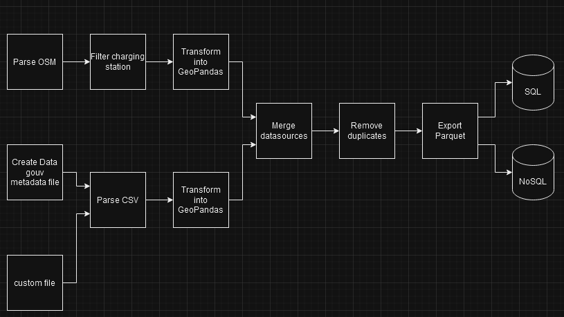

# Introduction

Welcome to our Electric Charging Station Data Management Tool. This tool has been designed to facilitate access to and analysis of data available on the French government's OpenData site, as well as data from PBF (Protocolbuffer Binary Format) files.

## Key Features
- **Automated Download**: The tool automatically downloads the necessary files before parsing them.
- **Data Merging**: It merges charging points located within a specified radius to form coherent charging stations.
- **Flexible Export Options**: Data can be exported in Parquet format, with additional options for exporting to SQL or to a NoSQL database like MongoDB.

This tool is ideal for professionals and researchers looking to analyze charging infrastructure and contribute to the energy transition.

We invite you to explore the features of this tool and integrate it into your projects to optimize the management of charging stations.